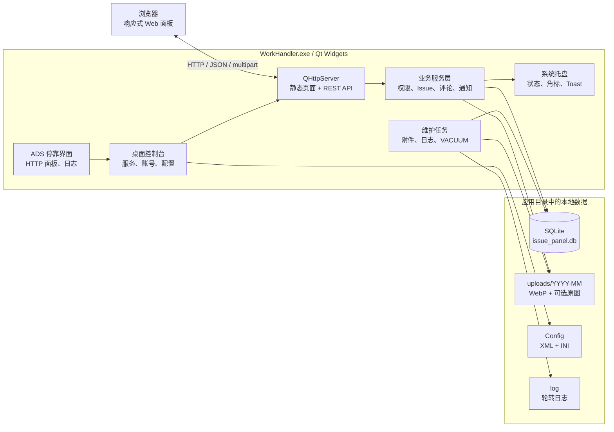
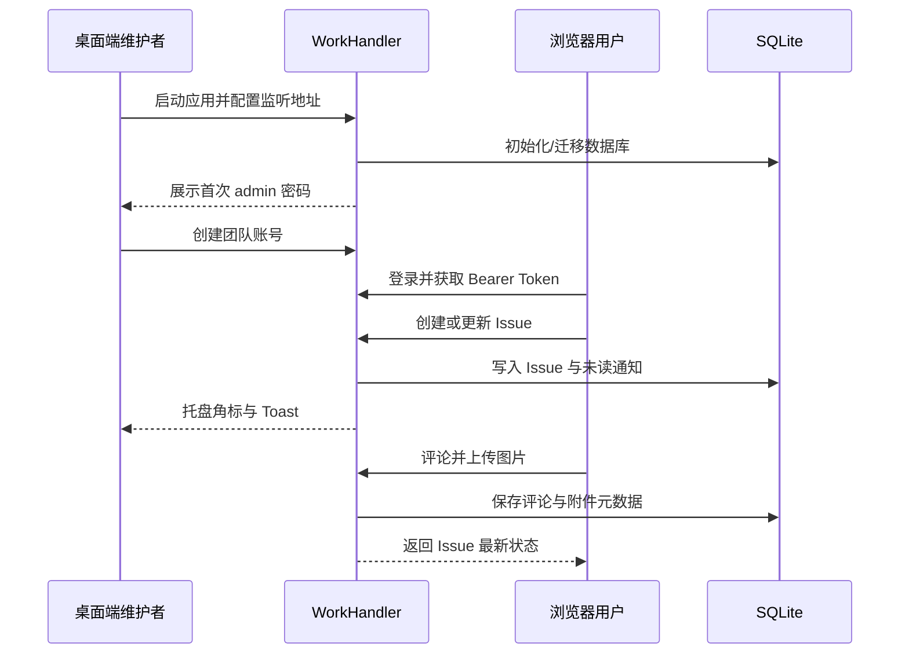

<p align="center">
  
</p>

<h1 align="center">WorkHandler</h1>

<p align="center">
  一个由 Qt 桌面端托管、通过浏览器协作的轻量级局域网 Issue 管理面板。
</p>

<p align="center">
  <a href="https://github.com/JKPXinit/WorkHandler/releases/latest"></a>
  
  
  
  
</p>

> 当前版本：`v0.1.1` 测试版。WorkHandler 面向个人及可信局域网内的小团队，不是公网 SaaS 服务。

## 目录

- [项目简介](#项目简介)
- [功能概览](#功能概览)
- [系统架构](#系统架构)
- [快速开始](#快速开始)
- [典型工作流](#典型工作流)
- [角色与权限](#角色与权限)
- [从源码构建](#从源码构建)
- [运行测试](#运行测试)
- [打包发布](#打包发布)
- [配置与数据](#配置与数据)
- [REST API](#rest-api)
- [项目结构](#项目结构)
- [安全与运行边界](#安全与运行边界)
- [许可证](#许可证)

## 项目简介

WorkHandler 将桌面控制台、HTTP 服务、响应式 Web 面板和 SQLite 数据库打包在同一个 Windows 应用中。维护者在桌面端管理服务、账号、日志与运行参数，团队成员只需在浏览器中访问同一台主机即可处理 Issue。

它适合以下场景：

- 在开发机、实验室电脑或内网服务器上快速部署一个工作面板；
- 不希望额外维护 Web 服务器、数据库服务和前端部署环境；
- 需要看板、Issue、评论、图片、通知和基础权限，但不需要大型项目管理平台；
- 希望所有业务数据保存在本机，且可以直接备份和迁移。

## 功能概览

### Web 工作面板

- 工作面板的创建、编辑、排序与删除；
- Issue 的创建、编辑、指派、状态流转和删除；
- 支持 `open`、`in_progress`、`resolved`、`closed` 四种状态；
- 支持 `low`、`medium`、`high`、`urgent` 四级优先级；
- 按面板、状态、优先级、负责人和关键词筛选；
- 按创建时间、优先级或标题排序；
- Issue 评论及评论内图片插入，单条评论最多 9 张图片；
- 响应式布局，可在桌面浏览器和移动端浏览器中使用；
- 每个 Issue 自动获得不可变 TaskID（例如 `T42`），支持复制、搜索直达和专注讨论页；
- 基于 URL Hash 的 Issue 深链接，例如 `#/issues/T42`，并兼容旧的数字链接。

### 桌面控制台

- HTTP 服务启动、停止、重启和连通性检测；
- 选择网卡/IP、端口或绑定所有 IPv4 接口；
- 本机访问地址与局域网访问地址管理；
- 桌面端账号管理和管理员密码修改；
- 系统托盘运行、服务状态图标和未读数字角标；
- 新通知 Toast，点击后直达对应 Issue；
- HTTP 服务面板与日志查看器采用 ADS 可停靠窗口；
- 支持锁定布局、保存布局和恢复布局；
- 英文与简体中文界面；
- 9 套内置主题及可自定义快捷键；
- 文件/控制台日志、按大小或按时间轮转、历史日志清理。

### 后端与数据

- 基于 `QHttpServer` 的内嵌 REST API 和静态页面服务；
- SQLite 本地持久化，启用外键约束并维护必要索引；
- `admin`、`user`、`guest` 三级角色权限；
- PBKDF2-HMAC-SHA256 密码哈希，随机盐和 100,000 次迭代；
- HMAC-SHA256 签名的 8 小时 Bearer Token；
- 修改密码后通过 Token Version 使旧会话失效；
- PNG、JPEG、WebP 图片输入，统一生成 WebP 正文图和缩略图；
- 图片按月份分目录存储，支持可选原图保留；
- 未读通知持久化，标记已读后直接删除；
- 启动及每日维护，包括附件恢复/清理、日志保留和月度 `VACUUM`。

## 系统架构



项目按 Controller、Service、DAO 分层组织后端逻辑。Controller 负责 HTTP 输入输出，Service 承担校验、权限和事务编排，DAO 集中访问 SQLite。桌面端通过 Qt 信号/槽接收服务状态和通知事件。

ADS 集成使用稳定的 Dock `objectName` 保存/恢复布局，目前包含 `HttpServerManagerDock` 和 `LogViewDock` 两个业务停靠窗口。

## 快速开始

### 方式一：下载 Release

1. 打开 [Releases](https://github.com/JKPXinit/WorkHandler/releases/latest)，下载最新的 `WorkHandler_*_Release.zip`。
2. 将压缩包完整解压到一个当前用户可写的目录。
3. 运行 `WorkHandler.exe`。
4. 首次启动时，程序会创建本地数据库，并在桌面端 HTTP Server 面板显示随机生成的 `admin` 初始密码。
5. 默认服务地址为 `http://127.0.0.1:8080/`。点击桌面端的“打开 Web 面板”，或直接使用浏览器访问该地址。

> 请立即妥善保存首次启动时显示的管理员密码。程序不会使用固定的默认管理员密码。

### 创建团队账号

桌面端负责创建普通账号。新账号默认角色为 `user`，初始密码为：

```text
123456
```

普通用户登录 Web 面板后，应立即通过个人菜单将密码修改为 8 至 256 个字符。固定的 `admin` 账号只能在桌面应用中修改密码。

### 允许局域网访问

默认配置只监听 `127.0.0.1`，其他设备无法访问。需要共享给局域网成员时：

1. 在 HTTP Server 面板选择实际网卡/IP，或启用“绑定所有接口”；
2. 确认端口，默认是 `8080`；
3. 保存并重启 HTTP 服务；
4. 在 Windows 防火墙中允许 `WorkHandler.exe` 或所选 TCP 端口；
5. 其他设备访问 `http://<主机局域网IP>:8080/`。

## 典型工作流



## 角色与权限

| 功能 | Admin | User | Guest |
| --- | :---: | :---: | :---: |
| 查看面板、Issue、评论和附件 | ✅ | ✅ | ✅ |
| 创建 Issue | ✅ | ✅ | ❌ |
| 编辑自己创建的 Issue | ✅ | ✅ | ❌ |
| 编辑其他人创建的 Issue | ✅ | ❌ | ❌ |
| 修改自己创建的 Issue 状态 | ✅ | ✅ | ❌ |
| 删除 Issue | ✅ | ❌ | ❌ |
| 发表评论/插入图片 | ✅ | ✅ | ❌ |
| 创建、编辑、排序和删除面板 | ✅ | ❌ | ❌ |
| 查看和维护用户 | ✅ | ❌ | ❌ |
| 读取服务配置 API | ✅ | ❌ | ❌ |

说明：

- `admin` 是受保护的固定管理员账号，不能重命名、降级或删除；
- Issue 的报告人由当前登录用户确定，不能通过 API 伪造；
- Issue 删除、面板删除会同步清理关联记录和附件文件；
- Guest 是只读角色。

## 从源码构建

### 环境要求

- Windows 10/11 x64；
- Visual Studio 2022 C++ 工具链（MSVC x64）；
- Qt `6.8.3` MSVC 2022 64-bit；
- Qt 模块：Core、Gui、Widgets、Network、Sql、HttpServer、LinguistTools；
- 构建测试时还需要 Qt Test；
- CMake `3.21` 或更高版本；
- Ninja，或由 Qt Creator 管理的兼容 CMake Generator。

项目内置的 Qt Advanced Docking System 是 Windows x64 MSVC 预编译库，因此当前 CMake 配置会拒绝非 Windows 或 32 位构建。

### 使用 Qt Creator

1. 在 Qt Creator 中打开 `Source/CMakeLists.txt`；
2. 选择 Qt 6.8.3 MSVC 2022 64-bit Kit；
3. 配置 `Release` 构建；
4. 构建并运行 `WorkHandler` 目标。

### 使用 PowerShell

先在 Visual Studio Developer PowerShell 中执行，并按本机路径调整 `$qtRoot`：

```powershell
$qtRoot = "C:\Qt\6.8.3\msvc2022_64"

cmake -S Source -B build\release -G Ninja `
  -DCMAKE_BUILD_TYPE=Release `
  -DCMAKE_PREFIX_PATH="$qtRoot" `
  -DBUILD_TESTING=ON

cmake --build build\release
```

构建结束后，CMake 会自动将 `qtadvanceddocking.dll` 复制到可执行文件旁边。开发环境运行时还需要确保 Qt DLL 可被找到：

```powershell
$env:Path = "$qtRoot\bin;$env:Path"
.\build\release\WorkHandler.exe
```

## 运行测试

项目包含三组 Qt Test 测试：

- `workhandler_httpserver_tests`：认证、迁移、权限、CRUD、筛选、通知、评论图片和级联清理；
- `workhandler_maintenance_tests`：数据库迁移、附件恢复/清理、日志保留和 `VACUUM`；
- `workhandler_tray_tests`：托盘角标、服务动作状态、URL 和 Toast Issue 身份。

```powershell
$qtRoot = "C:\Qt\6.8.3\msvc2022_64"
$buildDir = (Resolve-Path "build\release").Path
$env:Path = "$buildDir;$qtRoot\bin;$env:Path"

ctest --test-dir $buildDir -C Release --output-on-failure
```

将构建目录和 Qt 的 `bin` 放在 `PATH` 前部，可以避免系统中其他 Qt 或 MSVC 运行库抢先加载。

## 打包发布

根目录的 `package.ps1` 不负责编译。它会：

1. 定位已经完成的 Release 构建；
2. 复制 `WorkHandler.exe` 和 ADS 运行库；
3. 调用匹配当前 Qt Kit 的 `windeployqt`；
4. 补齐并检查 MSVC 运行库、Qt 插件和 SQLite 驱动；
5. 拒绝把数据库、配置、日志和源码资源混入发行包；
6. 输出带版本和时间戳的 ZIP，并打印 SHA-256。

```powershell
# 自动寻找 build/ 下最新的有效 Release 构建
.\package.ps1

# 或显式指定构建目录
.\package.ps1 -BuildDir .\build\release

# 只生成目录，不创建 ZIP
.\package.ps1 -BuildDir .\build\release -NoZip
```

默认产物写入 `dist/`。

## 配置与数据

WorkHandler 使用“便携式”目录布局，运行时数据位于 `WorkHandler.exe` 同级目录：

```text
<应用目录>/
├── WorkHandler.exe
├── Config/
│   ├── SoftwareConfig.xml    # UI、日志、HTTP 服务、快捷键配置
│   └── Windowscf.ini         # 主窗口和 ADS Dock 布局
├── data/
│   ├── issue_panel.db        # SQLite 主数据库
│   └── uploads/
│       └── YYYY-MM/
│           ├── <uuid>.webp
│           ├── <uuid>_thumb.webp
│           └── <uuid>_original.bin  # 仅启用保留原图时存在
└── log/
    └── ...                   # 当前及轮转日志
```

因此应用目录必须对当前用户可写。不要直接放入需要管理员权限才能写入的目录。

### 默认配置

| 配置 | 默认值 |
| --- | --- |
| 监听地址 | `127.0.0.1` |
| HTTP 端口 | `8080` |
| 自动启动服务 | 开启 |
| 绑定所有接口 | 关闭 |
| 图片最大宽度 | `1920` px |
| 缩略图宽度 | `480` px |
| WebP 质量 | `82` |
| 保留上传原图 | 关闭 |
| 日志输出 | 文件 |
| 日志轮转 | 开启，默认每日 |
| 日志备份数量 | `30` |
| 日志保留期 | `30` 天 |

### 备份与迁移

最直接的备份方式是退出 WorkHandler 后复制整个 `data/` 目录。恢复时，将备份的 `data/` 放回目标应用目录，再启动程序。程序会在初始化阶段执行兼容的数据库迁移和附件维护。

如需保留桌面端偏好和 Dock 布局，同时备份 `Config/`。

## REST API

除 `/`、`/index.html`、`/api/health` 和登录接口外，API 需要：

```http
Authorization: Bearer <token>
```

成功响应统一为：

```json
{
  "success": true,
  "data": {}
}
```

失败响应统一包含错误代码和可读消息。服务支持 JSON 请求，并为评论图片使用 `multipart/form-data`。

### 主要端点

| 方法 | 路径 | 用途 | 权限 |
| --- | --- | --- | --- |
| GET | `/`、`/index.html` | 内置 Web 面板 | 公开 |
| GET | `/api/health` | 健康检查 | 公开 |
| POST | `/api/auth/login` | 登录并获取 Token | 公开 |
| POST | `/api/auth/logout` | 结束客户端登录流程 | 已登录 |
| GET | `/api/auth/me` | 当前用户 | 已登录 |
| PUT | `/api/auth/password` | 修改当前普通用户密码 | User/Guest |
| GET | `/api/users/options` | 获取可指派用户选项 | 已登录 |
| GET | `/api/users`、`/api/users/:id` | 用户列表/详情 | Admin |
| PUT/DELETE | `/api/users/:id` | 更新/删除用户 | Admin |
| GET/POST | `/api/blocks` | 面板列表/创建 | 已登录/Admin |
| GET/PUT/DELETE | `/api/blocks/:id` | 面板详情/更新/删除 | 已登录/Admin/Admin |
| GET | `/api/issues` | Issue 列表与筛选 | 已登录 |
| GET | `/api/blocks/:id/issues` | 指定面板的 Issue | 已登录 |
| GET/PUT/DELETE | `/api/issues/:taskId` | Issue 详情/更新/删除 | 已登录/报告人或 Admin/Admin |
| POST | `/api/issues` | 创建 Issue | Admin/User |
| PUT | `/api/issues/:taskId/status` | 状态流转 | 报告人或 Admin |
| GET/POST | `/api/issues/:taskId/comments` | 评论列表/发表评论及图片 | 已登录/Admin 或 User |
| GET | `/api/attachments/:id` | 读取 WebP 图片 | 已登录 |
| GET | `/api/attachments/:id?size=thumb` | 读取缩略图 | 已登录 |
| GET | `/api/notifications` | 当前用户未读通知 | 已登录 |
| GET | `/api/notifications/unread-count` | 未读数量 | 已登录 |
| PUT | `/api/notifications/:id/read` | 标记单条已读并删除 | 当前接收人 |
| PUT | `/api/notifications/read-all` | 全部标记已读并删除 | 已登录 |
| GET | `/api/server/config` | 读取服务配置 | Admin |

用户注册和 HTTP 服务配置写入由桌面应用管理。`POST /api/users` 会返回 `405 Method Not Allowed`，服务也不提供远程重启接口。

### TaskID

TaskID 是 Issue 数据库主键的规范公开表示：`issues.id = 42` 对应 `T42`。Issue 响应同时返回整数 `id` 和字符串 `task_id`；通知响应保留 `related_id`，并返回 `related_task_id`。TaskID 不单独存入数据库，Issue 删除后的编号不会复用。

Issue 详情、状态和评论端点接受 `T42`、`t42` 以及兼容旧客户端的 `42`。响应和 Web 路由始终输出大写 `T42`；`T0`、`T042` 等非法格式返回 `400 invalid_task_id`。

### Issue 查询参数

`GET /api/issues` 和 `GET /api/blocks/:id/issues` 支持：

| 参数 | 可用值/说明 |
| --- | --- |
| `block_id` | 正整数面板 ID |
| `status` | `open`、`in_progress`、`resolved`、`closed` |
| `priority` | `low`、`medium`、`high`、`urgent` |
| `assignee_id` | 正整数用户 ID |
| `q` | 标题/描述关键词，最长 200 字符 |
| `sort` | `created_desc`、`created_asc`、`priority_desc`、`title_asc` |

示例：

```http
GET /api/issues?status=open&priority=high&sort=created_desc
```

## 项目结构

```text
WorkHandler/
├── Source/
│   ├── CMakeLists.txt
│   ├── main.cpp
│   ├── mainwindow.*
│   ├── html/index.html              # 内嵌响应式 Web 应用
│   ├── server/
│   │   ├── api/                     # API 上下文和 multipart 解析
│   │   ├── blocks/                  # 面板 Controller/Service/DAO
│   │   ├── issues/                  # Issue Controller/Service/DAO
│   │   ├── comments/                # 评论 Controller/Service/DAO
│   │   ├── attachments/             # 图片处理与附件存储
│   │   ├── notifications/           # 未读通知和业务事件
│   │   ├── maintenance/             # 日常维护与 VACUUM
│   │   ├── databasemanager.*        # Schema、迁移、用户数据
│   │   ├── httpserver.*             # QHttpServer 生命周期与核心路由
│   │   ├── passwordhasher.*
│   │   └── tokenhelper.*
│   ├── myUI/
│   │   ├── customDialog/            # 关于、日志、HTTP 服务对话框
│   │   ├── feature/                 # 配置、日志、快捷键、退出模式
│   │   └── ui/                      # Dock、主题、语言、托盘、Toast
│   ├── tests/                       # Qt Test 测试集
│   ├── theme/                       # 内置 QSS 主题
│   ├── language/                    # 中英文翻译资源
│   └── 3rdparty/QtDock/             # ADS 头文件和 Windows x64 库
├── Documents/                       # 需求与设计文档
├── package.ps1                      # Windows Release 打包脚本
└── dist/                            # 本地发行产物（不应提交运行数据）
```

## 安全与运行边界

- 服务当前使用 HTTP，不提供内置 TLS/HTTPS；
- CORS 当前允许任意 Origin，并依赖 Bearer Token 鉴权；
- 默认仅绑定回环地址，建议只在可信局域网内开放；
- 不建议把端口直接映射到互联网；
- 如需跨不可信网络访问，应在前方部署带 HTTPS、访问控制和限流的反向代理；
- Bearer Token 默认有效期为 8 小时，请勿在日志、截图或公开渠道中泄露；
- 上传图片限制为 PNG/JPEG/WebP，单张最大 10 MiB，单条评论总计最大 30 MiB；
- 图片解码限制为 4,000 万像素，并限制 WebP 尺寸，降低异常图片带来的资源风险；
- 月度 `VACUUM` 可能短暂停顿 HTTP 请求处理，维护器会记录相关日志；
- 发布包刻意不包含 `Config/`、`data/`、`log/` 和 `uploads/`，升级前请自行备份数据。

## 许可证

当前仓库尚未提供项目级 `LICENSE` 文件。在许可证明确之前，请不要假定 WorkHandler 源码可以被任意复制、修改或再分发。

项目包含 [Qt Advanced Docking System](https://github.com/githubuser0xFFFF/Qt-Advanced-Docking-System)，其许可为 LGPL v2.1。Qt 及其他第三方组件分别遵循各自许可证。准备公开分发或接受外部贡献前，建议补充项目许可证和第三方许可清单。

## 致谢

- [Qt](https://www.qt.io/)：桌面 UI、网络、HTTP、SQL、图像和测试基础设施；
- [Qt Advanced Docking System](https://github.com/githubuser0xFFFF/Qt-Advanced-Docking-System)：桌面端可停靠面板能力；
- [SQLite](https://www.sqlite.org/)：无需独立服务的本地数据存储。

---

问题反馈和功能建议请使用 [GitHub Issues](https://github.com/JKPXinit/WorkHandler/issues)。
