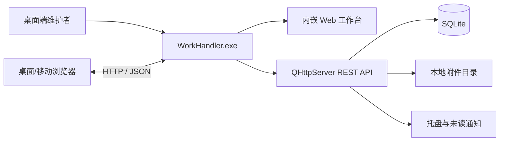

<p align="center">
  
</p>

<h1 align="center">WorkHandler</h1>

<p align="center">
  由 Qt 桌面端托管、通过浏览器协作的轻量级局域网 Issue 管理面板。
</p>

<p align="center">
  <a href="https://github.com/JKPXinit/WorkHandler/releases/latest"></a>
  
  
  
  <a href="./LICENSE"></a>
</p>

WorkHandler 将桌面控制台、HTTP 服务、响应式 Web 工作台和 SQLite 数据库打包在一个 Windows 应用中。维护者在桌面端管理服务和账号，团队成员只需使用浏览器访问同一台主机即可处理 Issue，无需另外部署 Web 服务器或数据库服务。

> 当前版本为 `v0.1.1` 测试版，面向个人及可信局域网内的小团队，不建议直接暴露到互联网。

## 核心功能

### Web 工作台

- 创建和管理工作面板，支持排序与颜色标识；
- 创建、编辑、指派和跟踪 Issue，支持四种状态与四级优先级；
- 按面板、状态、优先级、负责人和关键词筛选，并支持多种排序方式；
- 使用不可变 TaskID（例如 `T42`）搜索、复制链接和直达 Issue 详情；
- 在 Issue 下发表评论并上传图片、日志及普通附件；
- 响应式布局，可在桌面和移动端浏览器中使用；
- `admin`、`user`、`guest` 三级角色权限。

### 桌面控制台

- 启动、停止和重启内嵌 HTTP 服务，配置监听地址、网卡与端口；
- 管理团队账号、管理员密码、日志和运行参数；
- 使用 ADS Dock 管理 HTTP 服务、日志查看器和未读消息窗口；
- 以 block 列表查看未读通知，支持逐条已读和打开关联 Issue；
- 系统托盘显示服务状态与未读角标，新消息通过 Toast 提醒；
- 支持布局保存、主题、语言和自定义快捷键。

### 本地服务与数据

- 基于 `QHttpServer` 提供内嵌 Web 页面和 REST API；
- 使用 SQLite 保存用户、面板、Issue、评论、附件和未读通知；
- 使用 PBKDF2-HMAC-SHA256 存储密码，并通过签名 Bearer Token 鉴权；
- 修改密码后自动使旧会话失效；
- 自动维护附件、轮转日志和数据库，支持直接备份本地数据目录。

## 工作方式



后端按 Controller、Service、DAO 分层：Controller 处理 HTTP 输入输出，Service 负责校验、权限和业务编排，DAO 集中访问 SQLite。所有运行数据默认保存在应用目录中，便于备份和迁移。

## 快速开始

### 下载 Release

1. 从 [Releases](https://github.com/JKPXinit/WorkHandler/releases/latest) 下载最新的 `WorkHandler_*_Release.zip`；
2. 将压缩包完整解压到当前用户可写的目录；
3. 运行 `WorkHandler.exe`；
4. 首次启动时保存 HTTP Server 面板中随机生成的 `admin` 初始密码；
5. 点击“打开 Web 面板”，或访问 `http://127.0.0.1:8080/`。

默认只监听 `127.0.0.1`。需要让局域网成员访问时，在 HTTP Server 面板选择实际网卡/IP 或绑定所有 IPv4 接口，并在 Windows 防火墙中允许对应程序或端口。

## 从源码构建

环境要求：

- Windows 10/11 x64；
- Visual Studio 2022 C++ 工具链；
- Qt `6.8.3` MSVC 2022 64-bit；
- CMake `3.21` 或更高版本；
- Ninja。

项目内置的 Qt Advanced Docking System 是 Windows x64 MSVC 预编译库，因此当前构建配置不支持其他平台或 32 位目标。

在 Visual Studio 2022 Developer PowerShell 中执行：

```powershell
$qtRoot = "C:\Qt\6.8.3\msvc2022_64"

cmake -S Source -B build\release -G Ninja `
  -DCMAKE_BUILD_TYPE=Release `
  -DCMAKE_PREFIX_PATH="$qtRoot" `
  -DBUILD_TESTING=ON

cmake --build build\release
```

运行应用：

```powershell
$env:Path = "$qtRoot\bin;$env:Path"
.\build\release\WorkHandler.exe
```

也可以直接在 Qt Creator 中打开 `Source/CMakeLists.txt`，选择 Qt 6.8.3 MSVC 2022 64-bit Kit 后构建。

## 测试与打包

项目包含 HTTP 服务、维护任务和托盘 UI 三组 Qt Test 测试：

```powershell
$env:Path = "$(Resolve-Path build\release);$qtRoot\bin;$env:Path"
ctest --test-dir build\release -C Release --output-on-failure
```

Release 构建完成后，可使用根目录脚本部署 Qt 依赖并生成 ZIP：

```powershell
.\package.ps1 -BuildDir .\build\release
```

`package.ps1` 只负责打包，不会编译项目，也不会把数据库、配置、日志或上传文件加入发行包。

## 数据与安全

运行数据位于 `WorkHandler.exe` 同级目录：

```text
Config/                桌面设置与 ADS Dock 布局
data/issue_panel.db    SQLite 数据库
data/uploads/          图片和普通附件
log/                   当前日志与轮转日志
```

退出 WorkHandler 后复制 `data/` 即可备份业务数据；如需保留桌面布局和设置，同时备份 `Config/`。

安全边界：

- 服务使用 HTTP，不内置 TLS/HTTPS；
- 默认仅绑定回环地址，请只在可信局域网中开放；
- 不要把服务端口直接映射到互联网；
- 跨不可信网络使用时，应在前方部署带 HTTPS、访问控制和限流的反向代理；
- Bearer Token 默认有效期为 8 小时，请勿通过日志或公开截图泄露；
- 升级或替换程序前请备份 `data/`。

## 项目结构

```text
WorkHandler/
├── Source/
│   ├── myUI/           Qt 桌面界面、Dock、托盘和配置
│   ├── server/         Controller、Service、DAO 与 QHttpServer
│   ├── html/           内嵌响应式 Web 工作台
│   ├── tests/          Qt Test 测试集
│   └── 3rdparty/       Qt Advanced Docking System
├── package.ps1         Windows Release 打包脚本
└── LICENSE             MIT License
```

## 许可证

WorkHandler 自有代码采用 [MIT License](./LICENSE)，版权归 `JKPX` 所有。

第三方组件不受 WorkHandler 的 MIT License 替代，仍分别遵循各自许可证：

- [Qt](https://www.qt.io/)：根据实际使用方式遵循 Qt 对应许可证；
- [Qt Advanced Docking System](https://github.com/githubuser0xFFFF/Qt-Advanced-Docking-System)：LGPL v2.1；
- [SQLite](https://www.sqlite.org/)：Public Domain。

主题、图标及其他第三方资源保留其原有作者和许可声明。

## 致谢

- [Qt](https://www.qt.io/)：桌面 UI、HTTP、网络、SQL、图像和测试基础设施；
- [Qt Advanced Docking System](https://github.com/githubuser0xFFFF/Qt-Advanced-Docking-System)：桌面端可停靠窗口能力；
- [SQLite](https://www.sqlite.org/)：无需独立服务的本地数据存储。

问题反馈和功能建议请使用 [GitHub Issues](https://github.com/JKPXinit/WorkHandler/issues)。
